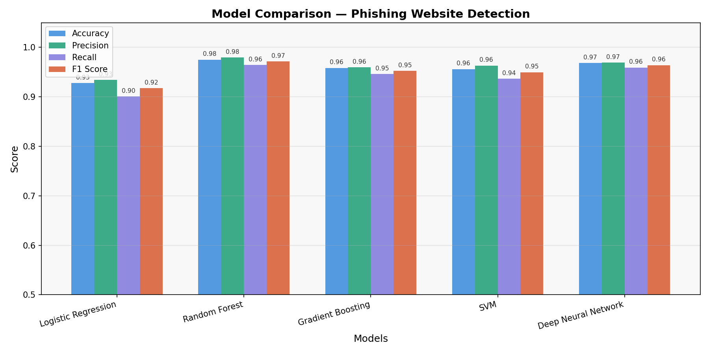

# 🛡️ Phishing Website Detection Using Machine Learning

### Class Project

---

## 📌 Objective

To build a machine learning system that automatically detects phishing websites based on URL and webpage features.

Phishing websites mimic legitimate websites to steal sensitive information such as passwords, banking details, and personal data.

---

## 📂 Project Structure

```
phishing_detection/
├── phishing_detection.py   ← Main script (run this)
├── predict.py              ← Predict on new URLs
├── convert_dataset.py      ← Converts ARFF → CSV
├── requirements.txt        ← Python dependencies
├── data/
│   └── phishing.csv        ← Dataset (generated after conversion)
└── outputs/
    ├── results.csv             ← Model performance table
    ├── model_comparison.png    ← Comparison graph
    ├── confusion_matrices.png  ← Confusion matrices
    └── feature_importance.png  ← Top features (Random Forest)
```

---

## ⚙️ Tech Stack

* Python
* Scikit-learn
* TensorFlow / Keras
* Pandas, NumPy
* Matplotlib

---

## 📊 Models Used

| Model                        | Type                | Library          |
| ---------------------------- | ------------------- | ---------------- |
| Logistic Regression          | Linear classifier   | scikit-learn     |
| Random Forest                | Ensemble (bagging)  | scikit-learn     |
| Gradient Boosting            | Ensemble (boosting) | scikit-learn     |
| Support Vector Machine (SVM) | Kernel-based        | scikit-learn     |
| Deep Neural Network (DNN)    | Neural network      | TensorFlow/Keras |

---

## 📊 Model Performance (Actual Results)

| Model               | Accuracy | Precision | Recall | F1 Score |
| ------------------- | -------- | --------- | ------ | -------- |
| Logistic Regression | 0.93     | 0.94      | 0.90   | 0.92     |
| Random Forest       | 0.98     | 0.98      | 0.96   | 0.97     |
| Gradient Boosting   | 0.96     | 0.96      | 0.95   | 0.95     |
| SVM                 | 0.96     | 0.96      | 0.94   | 0.95     |
| Deep Neural Network | 0.97     | 0.97      | 0.96   | 0.96     |

---

## 📈 Visualization



---

## 📊 Dataset

* Source: UCI Phishing Websites Dataset
* Total Samples: ~11,000
* Features: 30

### Feature Categories:

* **URL-based** → IP address, URL length, @ symbol, prefix/suffix
* **Domain-based** → SSL state, domain age, DNS record
* **HTML/JS-based** → iframe, mouseover, popups
* **External** → Google index, page rank, web traffic

### Feature Encoding:

* `-1` → Phishing
* `0` → Suspicious
* `1` → Legitimate

---

## 🚀 How to Run

### 1. Install dependencies

```bash
pip install -r requirements.txt
```

### 2. Convert dataset

```bash
python convert_dataset.py
```

### 3. Run the model

```bash
python phishing_detection.py
```

### 4. View results

All outputs will be saved in the `outputs/` folder.

---

## 🔍 Methodology

1. Data Collection (UCI Dataset)
2. Data Preprocessing
3. Feature Scaling
4. Model Training (5 algorithms)
5. Model Evaluation using:

   * Accuracy
   * Precision
   * Recall
   * F1 Score
6. Visualization of results

---

## 📌 Conclusion

* Random Forest achieved the best performance (~98% accuracy)
* Deep Neural Network also performed strongly (~97%)
* Ensemble models outperformed linear models
* Logistic Regression performed the lowest but still achieved good accuracy (~93%)

---

## 💡 Future Improvements

* Deploy as a web application (Streamlit/Flask)
* Real-time phishing detection system
* Browser extension for live URL checking
* Use advanced models like XGBoost

---

## 👨‍💻 Author

**Anips Kumar Jena**
